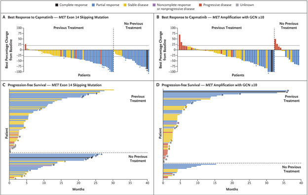

# Effective Visual Communication (EVC) exercise: Case study

## Efficacy of Capmatinib in Non Small Cell Lung Cancer (NSCLC) with MET mutations

Background:

 -	Phase 2 study of Capmatinib (MET receptor inhibitor) in NSCLC patients with various MET mutations
 -	Primary endpoint: overall response (complete or partial response) 
 -	Secondary endpoint: duration of response

Key question: 
- Does Capmatinib show meaningful response in patients with various types of MET mutation?

Reference for additional background, purpose and key messages:
- Wolf et al. NEJM 2020, 383:944-957, https://www.nejm.org/doi/full/10.1056/NEJMoa2002787

## Task 1:

Complete the Purpose Worksheet (separate handout). It is already half filled.

It is available here as a [pdf](https://github.com/GraphicsPrinciples/IBC2022/blob/main/Capmatinib_purpose_worksheet.pdf) or [word](https://github.com/GraphicsPrinciples/IBC2022/blob/main/Capmatinib_purpose_worksheet.docx) file. 

## Task 2:

See the main visualization of the study results. Improve it or create your own to display the key message(s).

 

# Handout

This information is also available as a [handout](https://github.com/GraphicsPrinciples/IBC2022/blob/main/Capmatinib_purpose_worksheet.pdf)
